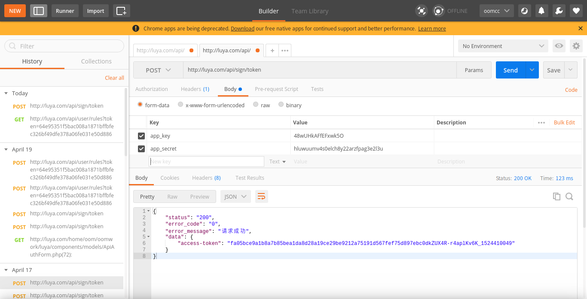
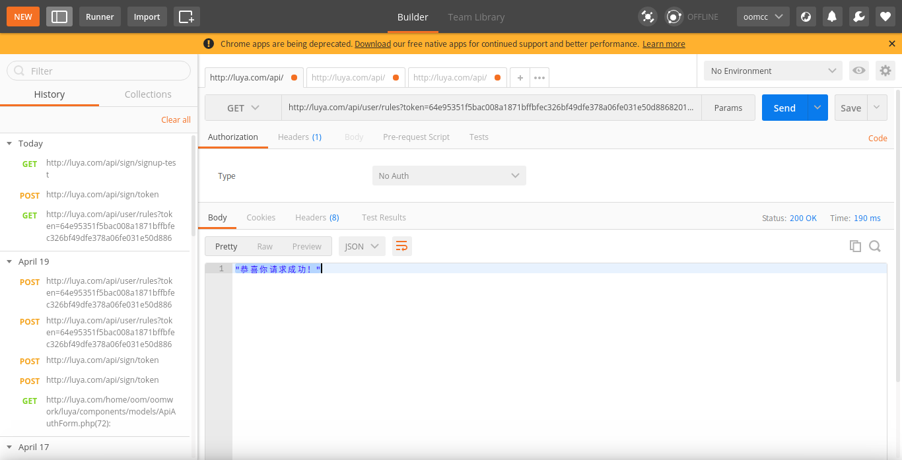

# Api Module 
[](https://travis-ci.org/baqianxin/luya-module-api)

File has been created with `module/create` command. 
 
## Installation

In order to add the modules to your project go into the modules section of your config:

```php
return [
    'modules' => [
        // ...
        'api' => [
            'class' => 'oom\api\frontend\Module',
            'useAppViewPath' => true, // When enabled the views will be looked up in the @app/views folder, otherwise the views shipped with the module will be used.
        ],
        'apiadmin' => 'oom\api\admin\Module',
        // ...
    ],
];
```

Update components
```php
    'components' => [

        //...
        'user' => [
            'identityClass' => 'oom\api\models\APIAuthUser',
            'enableAutoLogin' => true,
            'enableSession' => false,
            'loginUrl' => null,
        ],
        'urlManager' => [
            'rules' => [
                ['class' => 'yii\rest\UrlRule', 'controller' => 'api/user'],
            ],
        ],
        // ...   
    ]   
```

## Example 
* First: Insert the test user:`http://your.domain/api/sign/signup-test`

* Second:Request(post) the `http://your.domain/api/sign/token` with  params 'app_key'、'app_secret' to get the `'access token'`


* Test Api: `http://your.domain/api/user/rules?token='access-token'`


# Usage
* extend the ApiController
